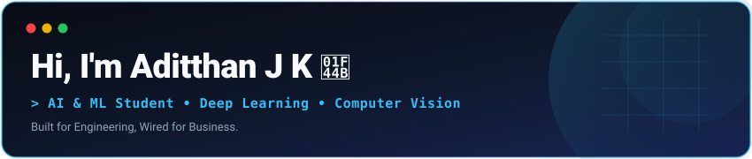
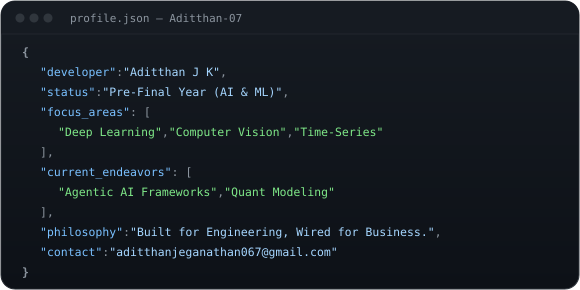

  

<!-- Hero Section: Big Cat Robot on Left + Developer JSON Terminal on Right -->

  
  &nbsp;&nbsp;
  

---

## 🛠️ Technology Stack & Tooling

  

 

### 💻 Programming Languages

  
  
  
  
  
  
  

### 🧠 AI, Deep Learning & Data Science

  
  
  
  
  
  
  
  
  

### 🌐 Web & Backend Development

  
  
  

### 🗄️ Databases

  
  

### ☁️ Cloud, DevOps & Developer Tools

  
  
  
  
  
  
  

---

<!-- Simple Business + Tech Philosophy Quote Card -->

  

---

## 📬 Connect With Me

  
  
  

